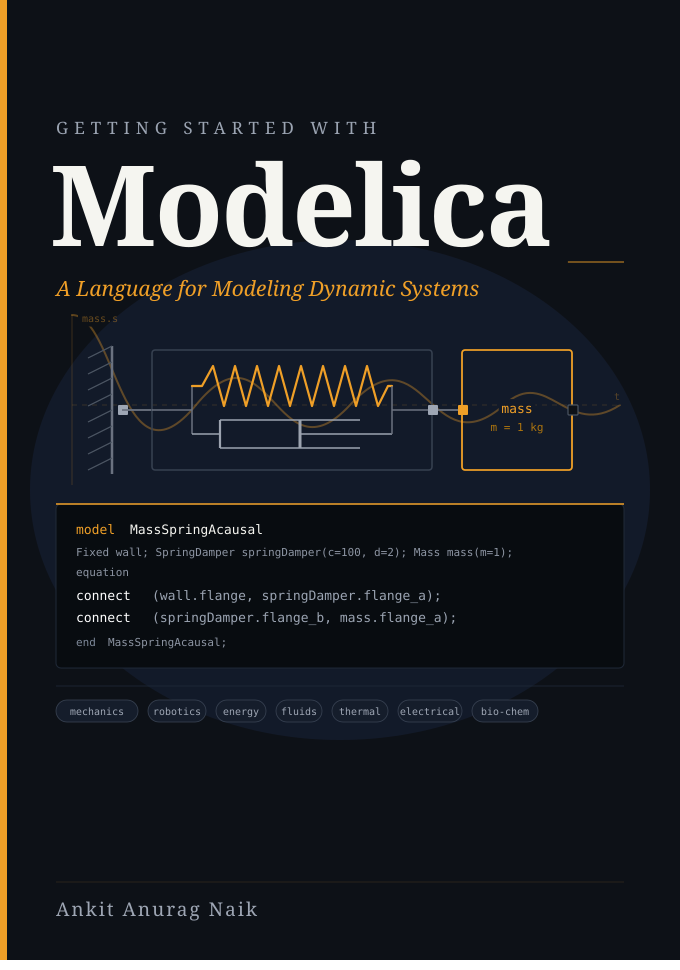

  

<h1 align="center">Getting Started with Modelica</h1>

  <strong>Companion Models &amp; Exercises</strong>

  <a href="https://www.amazon.com/Getting-Started-Modelica-LLM-Assisted-Engineering/dp/9153181786">Buy the book on Amazon</a> (also available on your local Amazon store)

---

This repository contains all the Modelica models and exercises from **Getting Started with Modelica**. Each chapter's models are organized into a Modelica package, ready to open and simulate.

## How to Use

1. **Download** this repository as a ZIP file (click the green **Code** button above, then **Download ZIP**)
2. **Extract** the ZIP file to a location on your computer
3. **Open** your Modelica tool (Wolfram System Modeler, OpenModelica, Dymola, etc.)
4. **Load the package** by opening `Chapters/package.mo` in your Modelica tool
5. All chapter packages and models will appear in your library browser

## What's Inside

| Package | Topic |
|---------|-------|
| **Chapter1** | Why Modelica? (RC circuit) |
| **Chapter2** | The MSL and Your First Model (heat transfer) |
| **Chapter3** | Causal vs. Acausal Modeling (mass-spring-damper) |
| **Chapter4** | Writing Your First Textual Model (HelloWorld, SpeedToPower, Resistor, ResistorWithHeat) |
| **Chapter5** | Naming Conventions, Units, and Package Design (unit checking) |
| **Chapter6** | Arrays and For Loops (resistor arrays) |
| **Chapter7** | Events and Hybrid Models (sample, pre, reinit, bouncing ball) |
| **Chapter8** | Inheritance and Partial Models (ResistorWithPowerMeter) |
| **Chapter9** | Records and Replaceable Components (turbine data, friction shaft) |
| **Chapter10** | Functions, Enumerations, inner/outer, assert (heated pipe system) |
| **Chapter11** | Using Data: Tables, Lookups, and Export (wind turbine data pipeline) |
| **Chapter12** | How Modelica Solves Equations (equation browser, thermal coupling) |
| **Chapter14** | Experiments, Solvers, and FMI (stiff model) |

Each chapter package includes a **TryThis** sub-package with the end-of-chapter exercises.

## Contact

For questions, feedback, or errata, connect with the author on [LinkedIn](https://www.linkedin.com/in/ankit-anurag-naik-30122a25).
